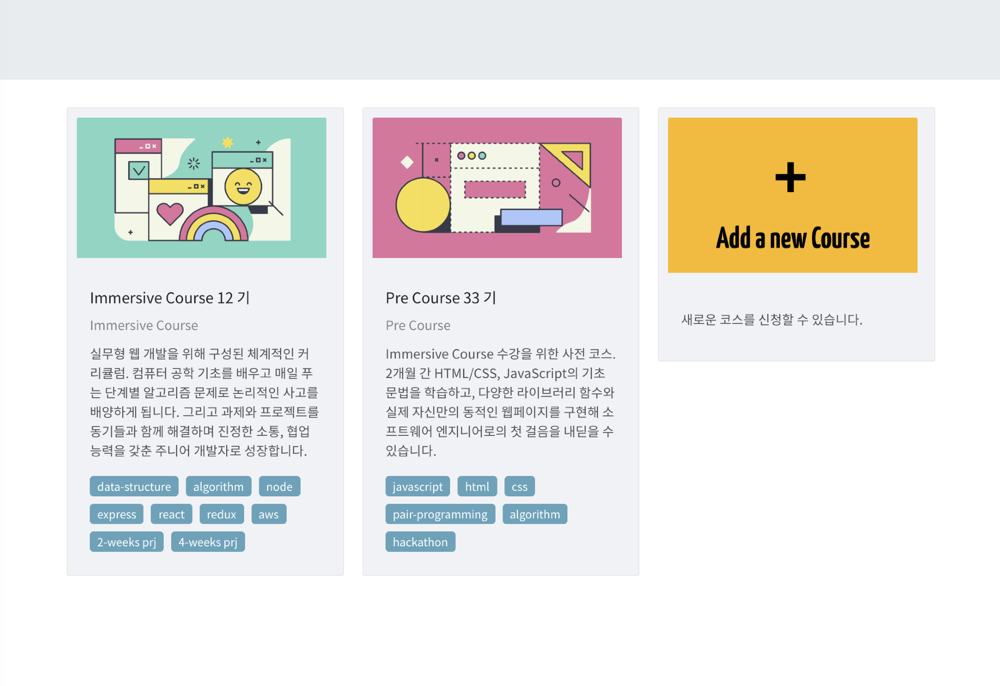

## [LMS (Learning Management System) for programming education](./projects/learnco/)

- @codestates / Feb. 2019 ~ May. 2019
- Site : [🏠 learnco.codestates.com](https://learnco.codestates.com/)
- Technologies
  - Front-end : React, Javascript
  - Back-end : Node, Express, GraphQL, Sequelize, MySQL
  - DevOps : AWS EC2, S3, ELB, Cloudfront, Scotty, CircleCI
- Major activities
  - Full-stack development.
  - Add user inter-action : user study status completeness and feedback on the study material.

## [Study contents recommendation and sharing service for self-taught learner](./projects/joy-learn)

- @codestates / Dec. 2018 ~ Jan. 2019
- Site : [🏠joy-learn.com](https://joy-learn.com)
- Full-stack development
  - Front-end : React, Javascript
  - Back-end : Node, Express, GraphQL, Sequelize, MySQL
  - DevOps : AWS EC2, S3, ELB, Cloudfront, Scotty, CircleCI
- Major activities

## [Renewal studystates.net for efficient contents editing](./projects/studystates)

- @codestates / Feb. 2019 ~ May. 2019
- Site : [🏠 dev.studystates.net](https://dev.studystates.net/)
- Technologies
  - Front-end : React, Gatsby, NetlifyCMS, Styled component, UI (Ant Design)
  - Back-end: Typescript, Node, express, TypeORM, MySQL, Passport
  - DevOps : AWS EC2/ELB, CircleCI, Netlify
- Major activities
  - Back-end \& DevOps development

## [HW Security 기반 상호 인증 TLS 이용한 SKT IoT PKI 구축 및 운영](./projects/iot-pki)

- IoT Device 보안 강화를 위한 HW Security 기반 상호 인증 TLS 이용한 SKT IoT PKI 구축 및 운영
- [🏠 SKT-IoT-PKI 안내 페이지 iotpki.sktelecom.com/](http://iotpki.sktelecom.com/)
- @SKTelecom, March. 2017 ~ Dec. 2017
- 주요 특징
  - SKT IoT 디바이스 인증을 위한 PKI infra-structure 구축 (RootCA/CA/RA).
  - HW Security (TPM, SecurityIC) 이용한 상호 인증 TLS를 위한 디바이스 및 라이브러리 개발.
  - device-server TLS mutual (two-way) authentication : HTTP over TLS, MQTT over TLS

## [Security CTF (Capture The Flag) for hobby](./projects/ctf)

- [🏠 2O2L2H team @CTFTime.org](https://ctftime.org/team/26928),
- CTF (Capture the flag) hacking as Hobby : system, pwnable, web, misc (Mostly in 2016 and 2017.)
- 2017 : DEF CON CTF Qualifier (179 th), SECUINSIDE CTF Quals (129 th)

